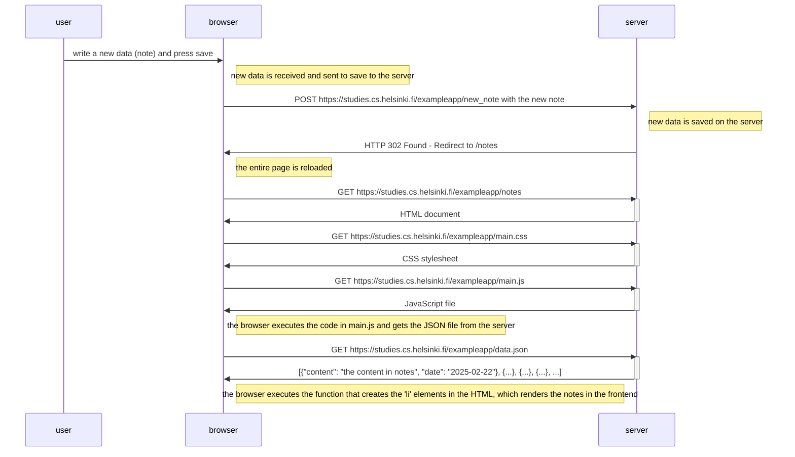

```mermaid
sequenceDiagram
    participant user
    participant browser
    participant server

    user->>browser: write a new data (note) and press save
    Note right of browser: new data is received and sent to save to the server

    browser->>server: POST https://studies.cs.helsinki.fi/exampleapp/new_note with the new note
    Note right of server: new data is saved on the server
    
    server->>browser: HTTP 302 Found - Redirect to /notes
    Note right of browser: the entire page is reloaded

    browser->>server: GET https://studies.cs.helsinki.fi/exampleapp/notes
    activate server
    server->>browser: HTML document
    deactivate server

    browser->>server: GET https://studies.cs.helsinki.fi/exampleapp/main.css
    activate server
    server->>browser: CSS stylesheet
    deactivate server

    browser->>server: GET https://studies.cs.helsinki.fi/exampleapp/main.js
    activate server
    server->>browser: JavaScript file
    deactivate server
    
    Note right of browser: the browser executes the code in main.js and gets the JSON file from the server

    browser->>server: GET https://studies.cs.helsinki.fi/exampleapp/data.json
    activate server
    server->>browser: [{"content": "the content in notes", "date": "2025-02-22"}, {...}, {...}, {...}, ...]
    deactivate server

    Note right of browser: the browser executes the function that creates the 'li' elements in the HTML, which renders the notes in the frontend

```